# Weather Wonders

<div align="center">
    
    <h1>Weather Wonders</h1>
    <p>An iOS app built with SwiftUI that provides real-time weather updates for any searched city using WeatherAPI. It features a clean, user-friendly interface with robust error handling and displays detailed, city-specific weather conditions, including temperature, location, and weather status, in an aesthetically pleasing layout.</p>
</div>

## Features

- **Search for Cities**: Enter a city name to get the current weather.
- **Error Handling**: Alerts are displayed for empty or invalid city inputs.
- **Loading Indicator**: A progress view is shown while fetching weather data.
- **Responsive UI**: Designed with Apple's latest UI/UX guidelines in mind.

## Screenshots

### iPhone 

&emsp;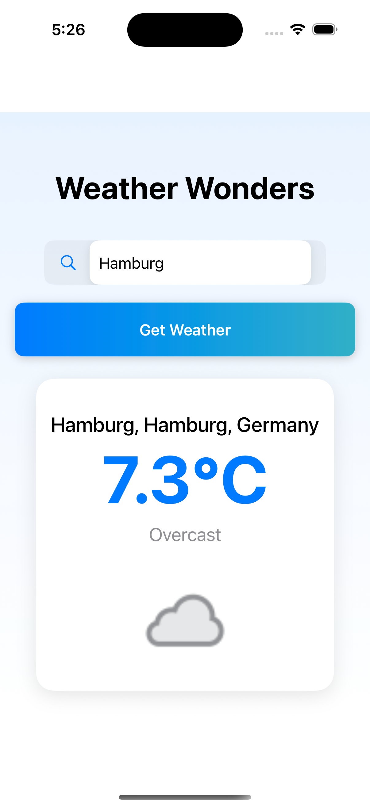&emsp;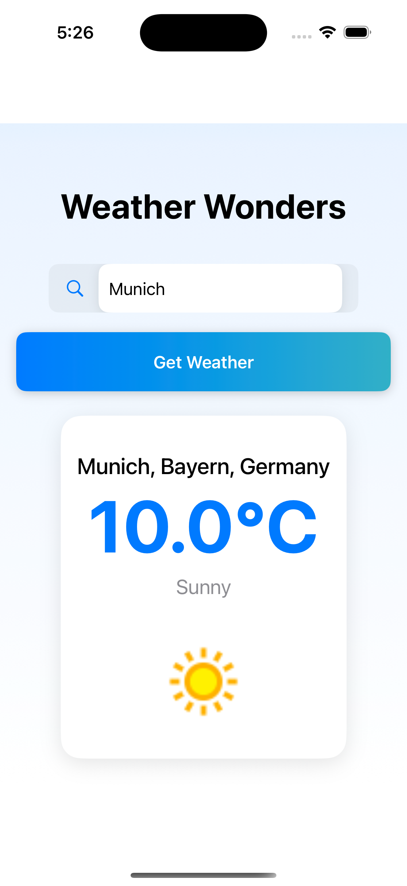&emsp;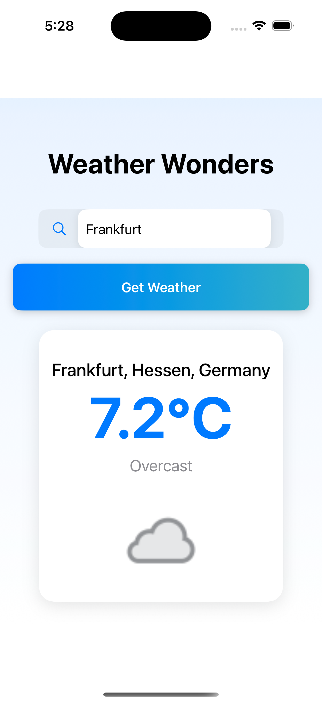&emsp;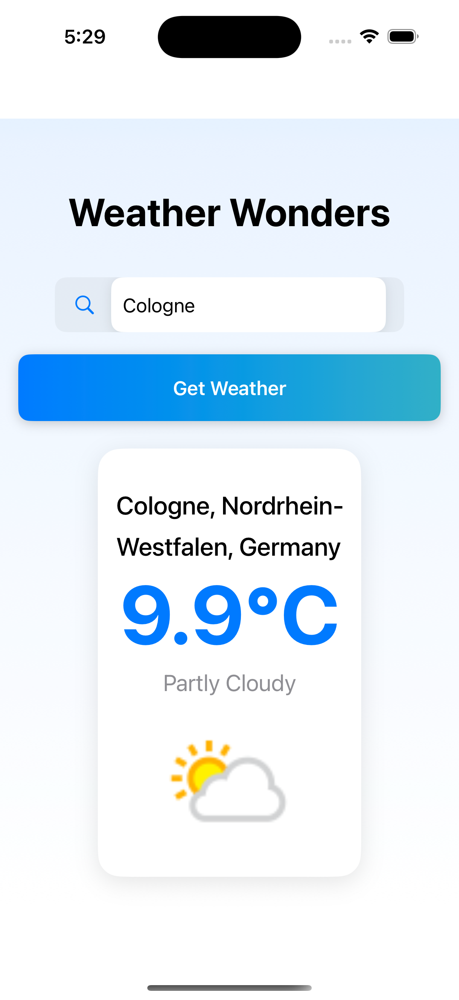&emsp;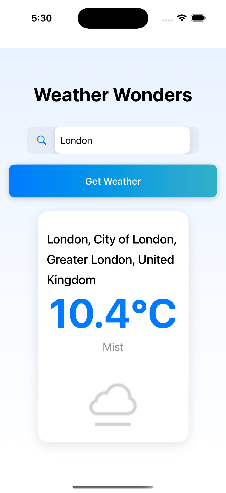

### iPad

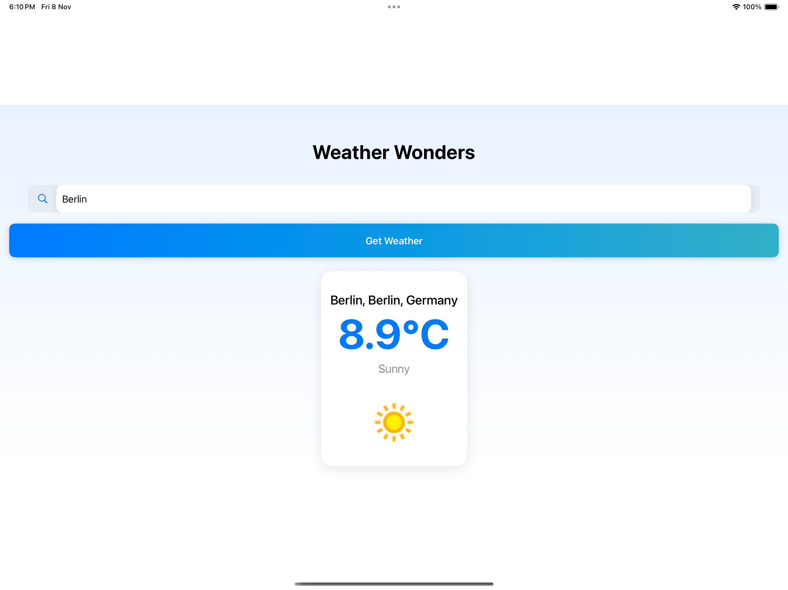&emsp;&emsp;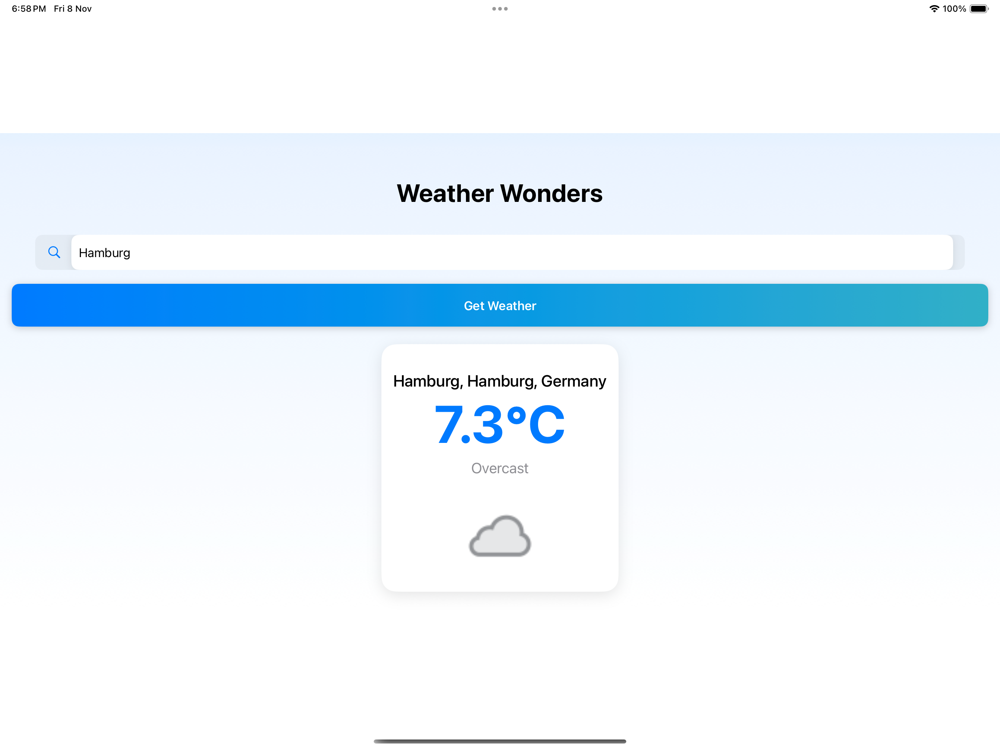&emsp;&emsp;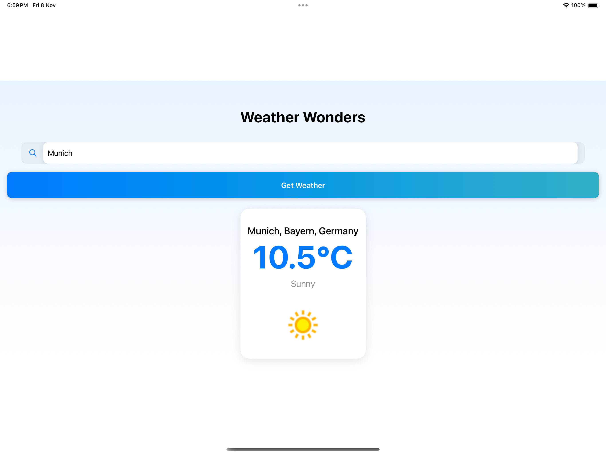
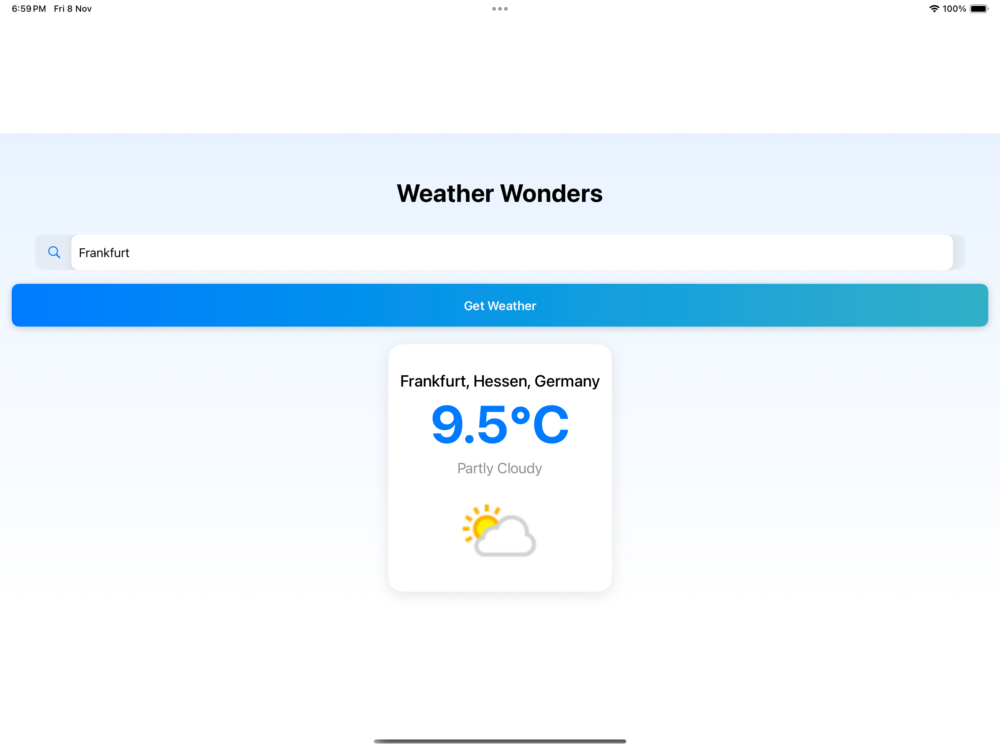&emsp;&emsp;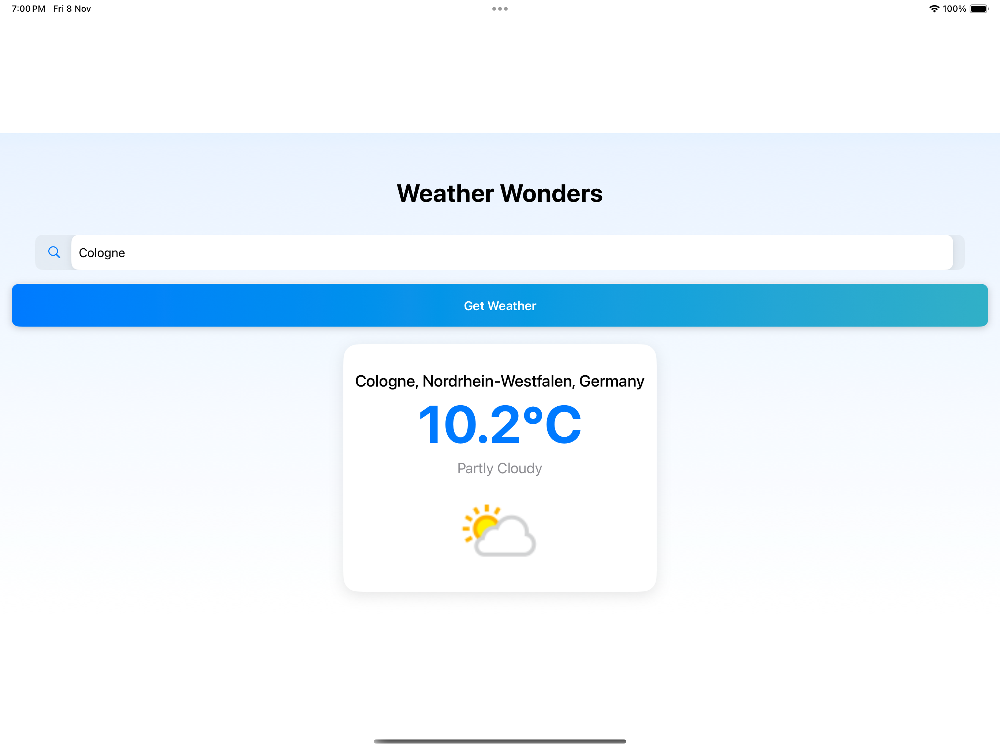&emsp;&emsp;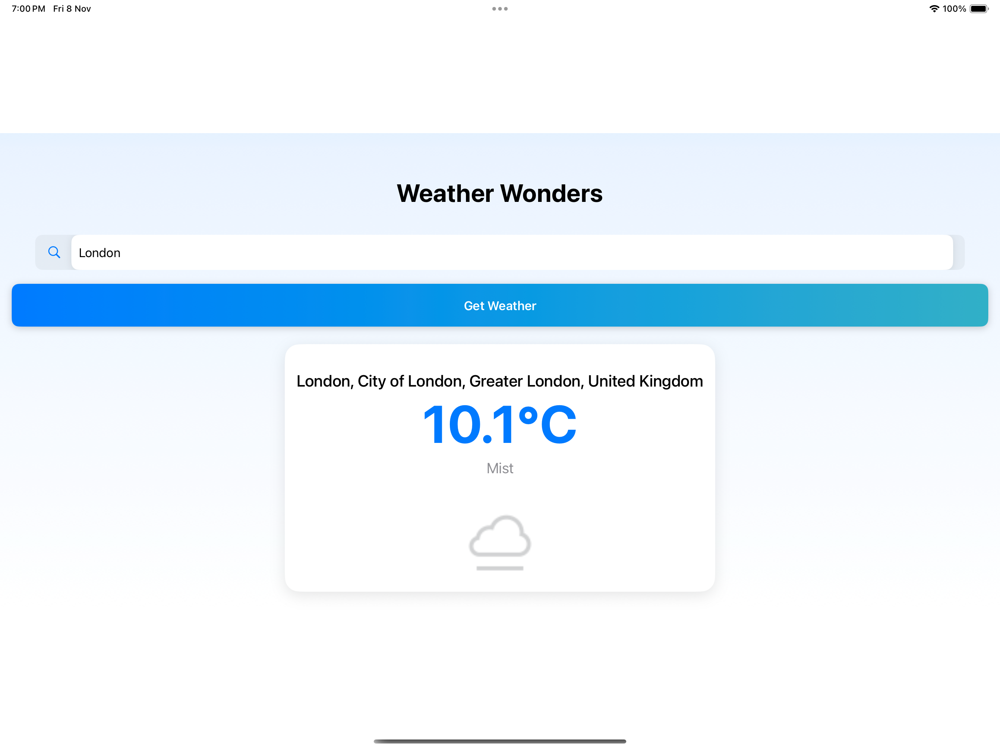

## Technologies Used

- Swift
- SwiftUI
- Combine
- URLSession
- WeatherAPI

## Installation

To get started with WeatherWonders, follow these steps:

1. **Clone the Repository:** Open your terminal and run the following command to clone the repository:


```bash
git clone https://github.com/seher-ayesha/weather-wonders.git
```


2. **Navigate to the Project Directory:** Change to the project directory:

```bash
cd weather-wonders
```

3. **Sign Up for Weather API:**

  - Go to [WeatherAPI.com](https://www.weatherapi.com/) and sign up for an account.
  - After signing up, create a new project to obtain your **API Key**. 

4. **Configure Your API Key:**

- Open the project in Xcode.
- Locate the "WeatherService.swift" file where the API key is stored. 
- Replace the placeholder API key with your actual API key obtained from WeatherAPI.com.

5. **Run the Application:**

- Ensure you have Xcode installed on your machine.
- Select a simulator or a connected device.
- Click the "Run" button in Xcode to build and run the application.


## Additional Information
- This project is built using SwiftUI and requires **iOS 15.0+ or later and Xcode 13.0 or later**. 
- Ensure that you have an internet connection to fetch weather data.

## Documentation

For a comprehensive guide on the app's setup, code structure, and SwiftUI design principles, check out our full article on Medium:

[Weather Wonders: Crafting a Quirky SwiftUI Weather App with API Integration](https://medium.com/@seher.ayesha/weather-wonders-crafting-a-quirky-swiftui-weather-app-with-api-integration-387c70149beb)


## Contributing

We welcome contributions! Here are some ways you can help make WeatherWonders even better:

- **Report Bugs:** If you encounter any issues, please open an issue to let us know.
- **Contribute Code:** If you’re a developer, follow the instructions below to get started!
- **Make Suggestions:** Have ideas for improvements? Open an issue with your ideas.
- **Improve Documentation:** Feel free to add or clarify documentation.


If you have a suggestion that would make this better, please fork the repo and create a pull request. You can also simply open an issue with the tag "enhancement". Don't forget to give the project a star! Thanks again!


### Instructions

1. Fork this repository.
2. Clone the forked repository.
3. Create your Feature Branch 

```bash
git checkout -b feature/AmazingFeature
```

4. Commit your Changes 

```bash
git commit -m 'Add some AmazingFeature'
```

5. Push to the Branch 

```bash
git push origin feature/AmazingFeature
```

6. Open a Pull Request.

## Future Enhancements

- **Location Services:** Allow users to get weather updates based on their current location.
- **Weather Forecast:** Provide a 5-day weather forecast for the selected city.
- **Favorite Cities:** Enable users to save their favorite cities for quick access.
- **Notifications:** Implement push notifications for severe weather alerts.
- **Dark Mode Support:** Ensure the app looks good in both light and dark modes.

## Credits
Developed by [Seher Ayesha](https://github.com/seher-ayesha)

## License

This project is licensed under the MIT License - please see the [LICENSE.md](https://github.com/seher-ayesha/weather-wonders/blob/main/LICENSE) file for details.


